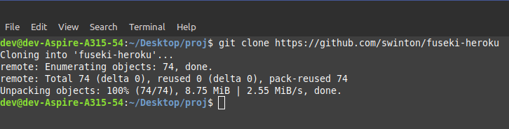
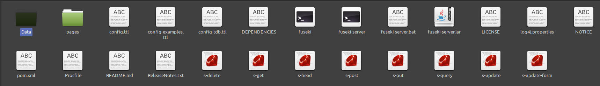
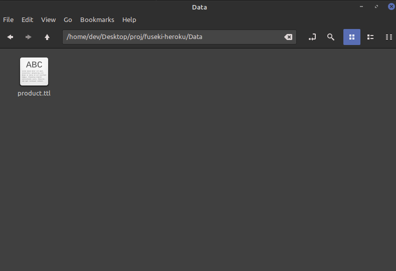
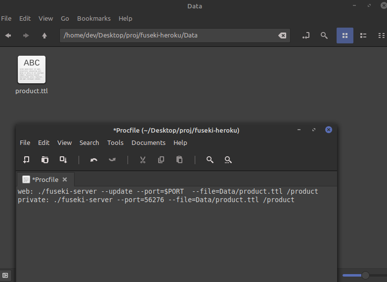
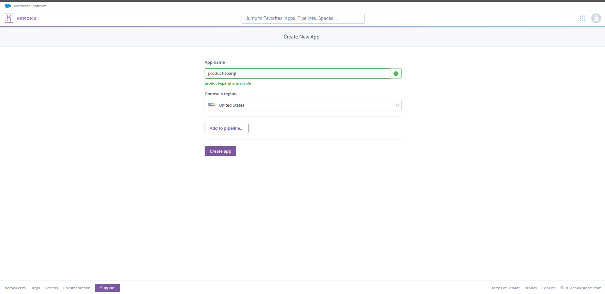
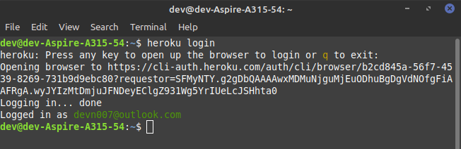
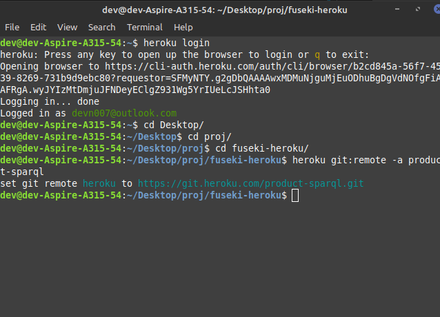
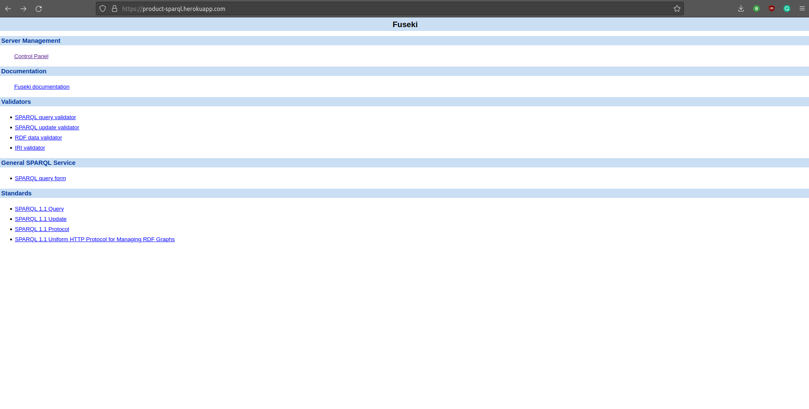
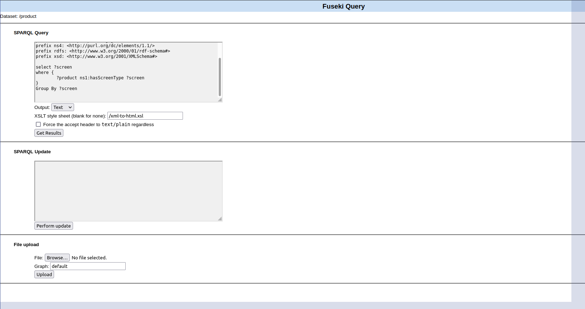
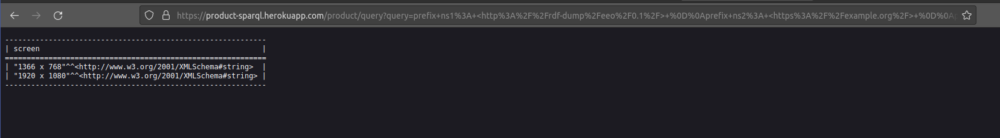

# SPARQL Endpoint 

* <h1>Goal :</h1> How to create a SPARQL enpoint using Apache Jena Fuseki & Heroku<br> <hr>
<br>

* **Prerequistes:- Basic understanding of Git, Heroku & command line or powershell or terminal**

<br>

* *Step 1:-* Clone <a href="https://github.com/swinton/fuseki-heroku">this</a> repo in your local system using command 

    ```
    git clone https://github.com/swinton/fuseki-heroku
    ``` 

    (make sure to install git in your system from <a href="https://git-scm.com/downloads">here</a> )



<br>

* *Step 2:-* Copy your RDF / Knowledge graph in the ```/Data/``` folder (make sure to delete all other extra RDFs from that folder) for reference check below screenshot, I have added ```product.ttl``` file into the ```/Data/``` folder.
<br>
<br>

<br>

<br>
<br>

<br>
<br>

* *Step 3:-* Download <a href="Procfile">Procfile</a> from the current report and delete the old ```Procfile``` from the ```fuseki-heroku``` folder and replace it with the one I have provided.

* *Step 4:-* Open ```Procfile``` using any text editor and make changes according to your rdf file. As in below screenshot you can see my file name is ```product.ttl``` make sure to changes according to your rdf file name.  <br>
<br>


<br>
<br>

* Example of Procfile:-
Let's say your rdf name is ```record.ttl``` then your required Procfile will be 
```
web: ./fuseki-server --update --port=$PORT  --file=Data/record.ttl /record 
private: ./fuseki-server --port=56276 --file=Data/record.ttl /record
```

* *Step 5:-* Create a new account (If you haven't already) on <a href=https://heroku.com>Heroku</a> & create a new app with any name you want, for this tutorial I've used ```procut-sparql```


<br>
<br>

* *Step 6:-* Install Heroku Cli in your system from <a href="https://devcenter.heroku.com/articles/heroku-cli">this</a> link

* *Step 7:-* Now open terminal / Powershell / command Line in ```fuseki-heroku``` folder and type command 

    ```
    heroku login
    ```

    (make sure to add heroku in your system varaible) & login with your account.

<br>
<br>




* *Step 8:-* Now be in the same folder ```fuseki-heroku``` and type 

    ```
    heroku git:remote -a your-app-name
    ``` 

    make sure to change **your-app-name** to your app's name. Example -  Since my app name is **product-sparql** the required command will be 
    
    ``` 
    heroku git:remote -a product-sparql
    ```


<br>

* *Step 9:-* Now run these command one by one in your terminal
<br>

    ```
    git add .
    git commit -am "make it better"
    git push heroku master
    ```

Now, open your app like this ```https://your-app-name.herokuapp.com/```.
<br>
<br>

In my case it's 
```https://product-sparql.herokuapp.com/```
<br>
<br>


<br>
<br>


Now go to control panel and select your rdf name and run sparql query.
<br>
<br>


<br>
<br>
