# Tutorial: Loading RDF into a Triplestore

## Background

RDF (Resource Description Framework) is a standardized yet flexible model for representing linked datasets as a knowledge graph. RDF has a nomenclature for naming nodes and edges in a graph.

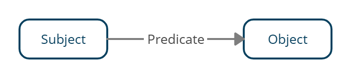

An edge is called a triple, the source node is called a subject, the edge name is called a predicate, and the target node is called an object. In a graph, a node can be in the subject position in one triple and in the object position in another triple. RDF describes data using a collection of such triples. Triple statements are data entities that contain these subjects, predicates, and objects.

### Representing RDF

RDF data can be stored or transmitted by serializing the data structures to one of the following formats:

- **RDF/XML**: Expresses the graph as an XML document. Historically, this was the first standardized format to store RDF data.
- **Turtle (Terse RDF Triple Language)**: Simpler and human-friendly format, RDF data is stored as semantic triples. Non-standardized subsets and supersets of the Turtle format also exist. N-Triples, N-Quads are subsets of Turtle and can also be used to represent the RDF data. N3 or Notation3 is a superset of Turtle that provides other features such as inference rule declarations.
- **JSON-LD**: Popular format, heavily used for the Google Knowledge Graph for SEO and IoT. Uses JSON for representing the RDF linked data.

The nodes in RDF may be of different types as listed below:

- **IRIs**: Internationalized Resource Identifiers (IRIs) are strings that are used to identify the nodes and edges in a graph uniquely. IRIs usually appear to be URLs inside angled brackets, but they may or may not be valid web pages. They are used to reduce collisions in the database.
- **Blank Nodes**: Nodes which do not have unique identifiers or IRIs are blank nodes. Blank nodes can be reached by following its incident edges from other nodes.
- **Literals**: Literals are concrete values used to represent datatypes like strings, numbers, and dates. They must appear in the object part of the triples and are not allowed as subjects or predicates.

### Storing RDF

RDF Triples are stored in a specialized type of graph databases called triplestores or RDF stores. Data can be stored or retrieved from such databases through semantic queries. These may use a formal schema (ontologies) to structure the data being stored. Apache Jena, AllegraGraph, Blazegraph, GraphDB, Virtuoso, Amazon Neptune are some implementations of triplestores that may be used to store RDF data. Triplestores also come with SPARQL engines that allow the data to be queried as well.

### Inputs

- Triplestore (Blazegraph, Virtuoso, GraphDB, etc.)
- RDF Data (using sample data)

### Outputs

A Populated Knowledge Graph in the triplestore that can be queried using a SPARQL Client.

## Module 1: Installing and Configuring Triplestore

In this tutorial, we will use Blazegraph as the RDF store. [Blazegraph][blazegraph] is an open-source graph database designed to store RDF triples. Blazegraph is distributed as JAR and WAR archives for deployment apart from installers, which makes running an instance straightforward. Java (JDK/JRE) 9+ is needed to run Blazegraph. Refer https://openjdk.java.net/install/ to install a compatible version and edit the system environment variables so that `java` is available on the `PATH`.

- Download the JAR artifact from https://github.com/blazegraph/database/releases and save it to a folder on your local machine. At the time of writing this tutorial, Blazegraph 2.1.6 RC was the latest version available.

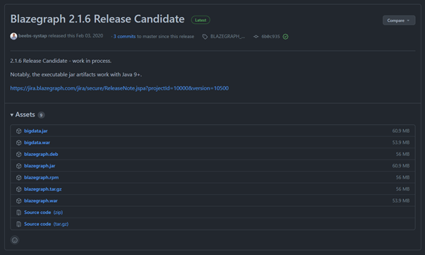

- Navigate to the folder where you have downloaded the JAR file. Start an instance of the triplestore by executing the following command in the terminal:

```bash
java -server -Xmx4g -jar blazegraph.jar
```

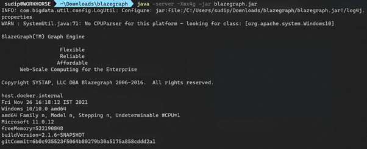

- Blazegraph should now be up and running. To access the Blazegraph Bigdata Workbench, navigate to the link displayed on the terminal on a web browser once the graph engine is up and running.

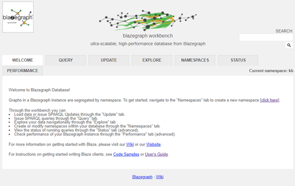

- Navigate to the Update tab to access the load data wizard. Select RDF as the data type and Turtle as the data format.


- At this stage, we can move to the next module to take a look at the data that we will be loading.

## Module 2: RDF Data in Turtle Format

RDF data is represented in the Turtle serialization format as triples that follow the following pattern:

```txt
<subject> <predicate> <object> . 
```

In case we must define multiple triples which have the same subject, we can use shorthand:

```txt
<subject>
    <predicate> <object> ;
    <predicate_2> <object_2> .
```

The Turtle format allows us to use additional shorthands called prefixed names to reference the IRIs. We can then use this prefix instead of the full IRI for any of the subject, predicate, or object parts. Here, `vcard:` is a local name (a prefix that we can use throughout the turtle file) that is mapped to a full IRI.

```SPARQL
@prefix vcard: <http://www.w3.org/2006/vcard/ns#> .
```

The prefix `:` is also valid and referred to as the default namespace for the graph. The predicate `a` is short for `rdf:type` that are used to link instances of classes which might group together nodes having similar characteristics.

```Turtle
<http://example.org/user/Sudipto_Ghosh>
a vcard:Individual ;
vcard:hasEmail "sudipto@ghosh.pro" ;
vcard:fn "Sudipto Ghosh" .
```

The RDF data for a few individuals in an organization can thus be represented in turtle as follows:

```Turtle
@prefix : <http://example.org/user/> .
@prefix p: <http://example.org/property/> .
@prefix vcard: <http://www.w3.org/2006/vcard/ns#> .

:Sudipto_Ghosh
    a vcard:Individual ;
    vcard:hasEmail "sudipto@ghosh.pro" ;
    vcard:fn "Sudipto Ghosh"  ;
    p:reportsTo :Sarika_Jain   .

:Sarika_Jain
    a vcard:Individual ;
    vcard:hasEmail "jsarika@nitk.ac.in" ;
    vcard:fn "Sarika Jain"  .
```

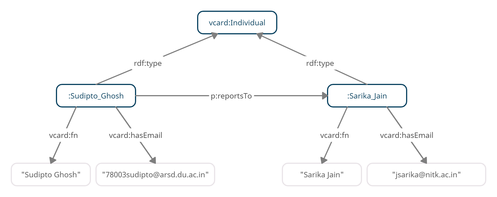

We shall now use this sample RDF data to load into the triplestore and run queries.

## Module 3: Loading RDF Data and Exploring

Save the RDF data in a file with the `.ttl` extension and upload the file to the form on the workbench. Click on update to load the data to the triplestore. In case there are any errors, they would be shown below the form. In case loading is successful, it would show the number of entities modified and the time it took in milliseconds. Triplestores allow RDF data to be uploaded in multiple serialization formats such as those listed in [Representing RDF](#representing-rdf).

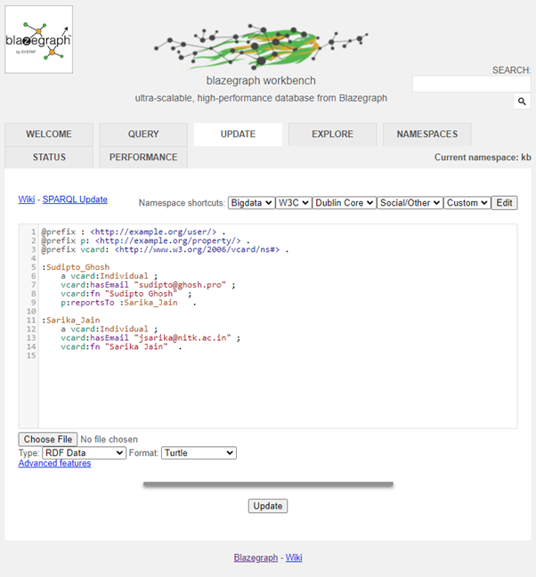

If we navigate to the Explore tab and enter one of the IRIs to the subject (say `<http://example.org/user/Sudipto_Ghosh>`, we can explore the knowledge graph from that node.

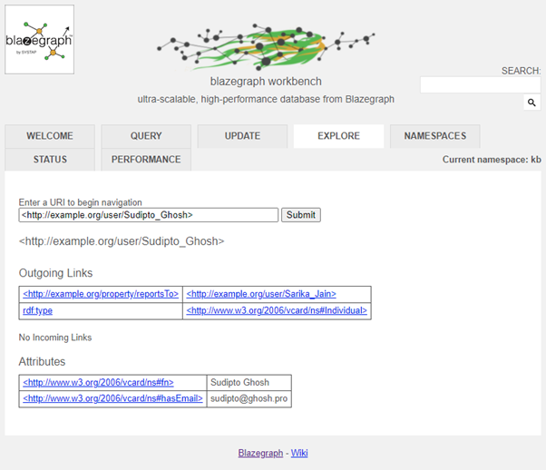

## Module 4: Querying Data using SPARQL

RDF Triplestores are queried using the SPARQL Protocol and RDF Query Language. A SPARQL query consists of a set of triple patterns in which the subject, predicate and the object can be variables or wildcards. Solutions to the variables are then found by matching the patterns in the query to triples in the dataset. Refer to this handy [SPARQL cheat sheet](https://www.slideshare.net/LeeFeigenbaum/sparql-cheat-sheet) to know a bit more about SPARQL. A simple explainer for SPARQL can be found at https://www.youtube.com/watch?v=FvGndkpa4K0.

In this tutorial, we have loaded the RDF data already. To get all triples in the triplestore, we assume the subject, the predicate, and the object to be wildcards, and select all triples matching the pattern. In effect, we retrieve all the triples. Using a more complex SPARQL query, we can select specific variables out of the dataset as well as use modifiers such as `LIMIT`, `ORDER BY` to get the desired output.

### Using the Blazegraph Workbench

The Blazegraph triplestore provides a web-GUI interface to execute SPARQL queries on its SPARQL engine. It then displays the triples in the output as an HTML table. To query the knowledge graph, navigate to the Query tab and type in the SPARQL query. Upon executing the query, the triples shall be output in a table as shown

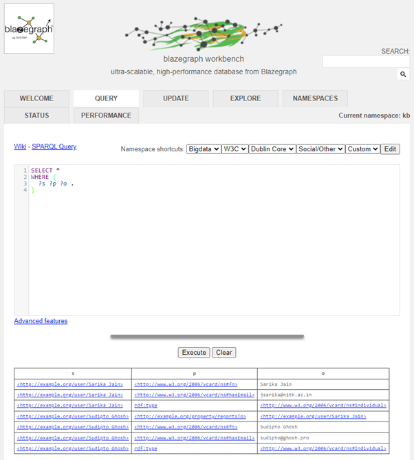

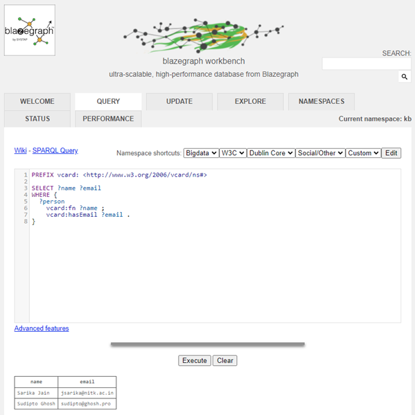

## Querying Programmatically in Python

The [SPARQLWrapper](https://rdflib.dev/sparqlwrapper/) module can be used to programmatically to execute SPARQL queries on a local or remote SPARQL endpoint. We use the Blazegraph SPARQL endpoint in this snippet to query the entities in the knowledge graph and their email addresses as shown.

```python
# !pip install SPARQLWrapper

from SPARQLWrapper import SPARQLWrapper, JSON

sparql = SPARQLWrapper("http://localhost:9999/blazegraph/sparql")
sparql.setQuery("""
PREFIX vcard: <http://www.w3.org/2006/vcard/ns#>
SELECT ?name ?email
WHERE {
    ?x vcard:fn ?name ;
       vcard:hasEmail ?email .
}
""")
sparql.setReturnFormat(JSON)
results = sparql.query().convert()

for result in results["results"]["bindings"]:
    print(result["name"]["value"], result["email"]["value"])

"""
Output:
http://example.org/user/Sarika_Jain jsarika@nitk.ac.in
http://example.org/user/Sudipto_Ghosh sudipto@ghosh.pro
"""
```

## Conclusion

At the end of the tutorial, we were able to deploy a triplestore, load RDF data in Turtle format and query the same using SPARQL queries. To learn more about RDF, SPARQL, and Blazegraph, you can refer the documentation and resources mentioned in [References](#references).

## References

- RDF, W3C. \<https://www.w3.org/TR/rdf11-concepts/\>
- SPARQL Overview, W3C. \<https://www.w3.org/TR/sparql11-overview/\>
- Terse RDF Triple Language Specification, W3C. \<https://www.w3.org/TR/turtle/\>
- Blazegraph. \<https://github.com/blazegraph/database\>
- RDFlib/SPARQLWrapper. \<https://github.com/RDFLib/sparqlwrapper\>

## Sample RDF Datasets

### DBPedia

https://databus.dbpedia.org/dbpedia/collections/latest-core

### GEMET

https://www.eionet.europa.eu/gemet/en/exports/rdf/latest

### 120 Years of Olympic History

https://github.com/wallscope/olympics-rdf 

## Exercises

### Question 1

Load the dataset containing facts about Olympic athletes [`olympics.ttl`](./data/olympics.ttl) to an RDF store and list the total number of athletes belonging to each country.

### Solution 1

Upon inspecting the dataset, we find it is RDF data stored in the Turtle serialization format. We load it into an RDF store such as Blazegraph as it natively supports the format.

To answer the question, we execute the following SPARQL query:

```sparql
PREFIX dbo: <http://dbpedia.org/ontology/>
PREFIX foaf: <http://xmlns.com/foaf/0.1/>
PREFIX rdf: <http://www.w3.org/1999/02/22-rdf-syntax-ns#>
PREFIX rdfs: <http://www.w3.org/2000/01/rdf-schema#>

SELECT ?country
       (COUNT(?athlete) AS ?total)
WHERE {
 ?s dbo:ground ?team ;
    rdfs:label ?country .
 
 ?athlete a foaf:Person ;
        dbo:team ?team .
}
GROUP BY ?country
ORDER BY DESC(?total)
LIMIT 10
```

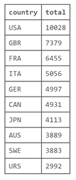

### Question 2

Load [`india.ttl`](./data/india.ttl) (Source: DBPedia) and list the IRIs for the regional languages related to the India entity in the data.

### Solution 2

Upon inspecting the dataset, we find it is RDF data stored in the Turtle serialization format. We load it into an RDF store such as Blazegraph as it natively supports the format.

To answer the question, we execute the following SPARQL query:

```sparql
PREFIX dbr: <http://dbpedia.org/resource/>
PREFIX dbp:<http://dbpedia.org/property/>

SELECT *
WHERE {
 dbr:India dbp:regionalLanguages ?language .
}
```

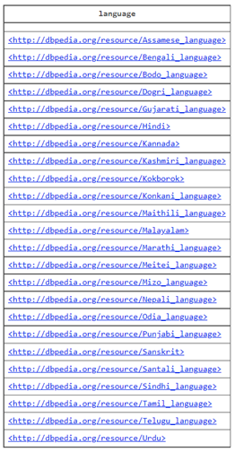

### Question 3

Load the GEneral Multilingual Environmental Thesaurus dataset containing terms and their definitions ([`gemet-definitions.rdf`](./data/gemet-definitions.rdf)) to an RDF store and list the thesaurus entries for terms that contain the substring "legal" in them.

### Solution 3

Upon inspecting the dataset, we find it is RDF data stored in the RDF/XML serialization format. We load it into an RDF store such as Blazegraph.

To answer the question, we execute the following SPARQL query:

```sparql
BASE <http://www.eionet.europa.eu/>
PREFIX skos: <http://www.w3.org/2004/02/skos/core#>

SELECT ?concept ?label ?definition
WHERE {

 ?concept skos:prefLabel ?label ;
          skos:definition ?definition .
 FILTER(CONTAINS(?label, "legal"))
}
```

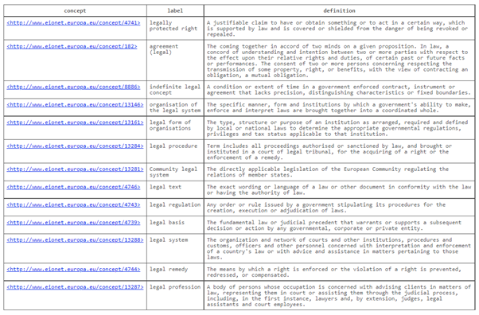

[blazegraph]: https://github.com/blazegraph/database "Blazegraph"
